# BoncukJS v2.0 Architecture Decision Document

_Real-time Speech Transcription Web Application_

---

## 0. Core Architecture Decision

## ⚠️ NO MERGING LOGIC - State-Preserving Streaming

**Decision:** Use **NVIDIA's State-Preserving Streaming** approach. NO merging logic required.

> Traditional approaches required 1,000+ lines of complex merging algorithms (Local Agreement, FastMerger).
> NVIDIA's new approach (Sep 2025) eliminates this entirely by preserving decoder state between chunks.

| Approach | Lines of Code | Accuracy | Complexity | Status |
|----------|---------------|----------|------------|--------|
| ~~FastMerger~~ | ~300 | Good | Low | ❌ DEPRECATED |
| ~~Local Agreement~~ | ~1,200 | Excellent | High | ❌ DEPRECATED |
| **State-Preserving** | ~0 | Better (per NVIDIA) | Minimal | ✅ **CHOSEN** |

---

## 0.1 🚀 BREAKTHROUGH: State-Preserving Streaming (NVIDIA's New Approach)

**Reference:** [NeMo PR #9106](https://github.com/NVIDIA-NeMo/NeMo/pull/9106), [HuggingFace Discussion #63](https://huggingface.co/nvidia/parakeet-tdt-0.6b-v2/discussions/63)

> *"The pipeline is significantly simplified, merging is removed, but the state is preserved between chunks. We observe both better quality and speed using the new approach."*
> — **@artbataev (NVIDIA)**, Sep 2025

### The Key Innovation: State Preservation Eliminates Merging

```
┌────────────────────────────────────────────────────────────────────────────┐
│                    TRADITIONAL APPROACH (Current)                          │
├────────────────────────────────────────────────────────────────────────────┤
│                                                                            │
│  Chunk 1: [0-10s]    →  Transcribe  →  "The quick brown fox"               │
│  Chunk 2: [6-16s]    →  Transcribe  →  "quick brown fox jumps over"        │
│  Chunk 3: [12-22s]   →  Transcribe  →  "fox jumps over the lazy dog"       │
│                            ↓                                               │
│           COMPLEX MERGING (1000+ lines of alignment logic)                 │
│                            ↓                                               │
│  Result: "The quick brown fox jumps over the lazy dog"                     │
│                                                                            │
│  ❌ Each chunk transcribed independently (no memory of previous)           │
│  ❌ Overlapping regions produce duplicates                                 │
│  ❌ Complex alignment algorithms needed                                    │
└────────────────────────────────────────────────────────────────────────────┘

┌────────────────────────────────────────────────────────────────────────────┐
│                    STATE-PRESERVING APPROACH (New)                         │
├────────────────────────────────────────────────────────────────────────────┤
│                                                                            │
│  Chunk 1: [0-4s]     →  Transcribe(state=null)    →  "The quick"          │
│                                                        state₁ = [h₁, c₁]   │
│  Chunk 2: [4-8s]     →  Transcribe(state=state₁)  →  "brown fox"          │
│                                                        state₂ = [h₂, c₂]   │
│  Chunk 3: [8-12s]    →  Transcribe(state=state₂)  →  "jumps over"         │
│                            ↓                                               │
│           SIMPLE CONCATENATION (no alignment needed!)                      │
│                            ↓                                               │
│  Result: "The quick" + "brown fox" + "jumps over" = Full transcript        │
│                                                                            │
│  ✅ Each chunk continues from previous state (memory preserved)            │
│  ✅ NO overlapping regions (chunks are sequential)                         │
│  ✅ NO merging needed - just concatenate outputs                           │
└────────────────────────────────────────────────────────────────────────────┘
```

### What State is Preserved?

In `parakeet.js`, the RNNT/TDT model uses an LSTM-based prediction network with hidden states:

```typescript
// Current parakeet.js (ONNX combined model)
interface DecoderState {
  state1: Tensor;  // [numLayers, 1, hiddenSize] - LSTM hidden state h
  state2: Tensor;  // [numLayers, 1, hiddenSize] - LSTM cell state c
}

// The state is already tracked internally but reset between calls!
// parakeet.js line 576-582:
let decoderState = null;  // ← Resets to null each transcribe() call

// ...
const res = await this._runCombinedStep(encTensor, lastToken, decoderState);
newDecoderState = res.newState;  // ← State IS returned but not exposed!
```

### Proposed Enhancement: Stateful Transcription API

```typescript
// NEW: Stateful transcription interface
interface StatefulTranscriptionOptions {
  previousState?: DecoderState;   // Pass state from previous chunk
  returnState?: boolean;          // Return new state for next chunk
  chunkOffset?: number;           // Time offset for this chunk (seconds)
}

interface StatefulTranscriptionResult {
  // Existing fields
  utterance_text: string;
  words: Word[];
  confidence_scores: ConfidenceScores;
  
  // NEW: State for continuation
  decoderState?: DecoderState;    // Pass to next chunk
  
  // NEW: Absolute timestamps (offset applied)
  absoluteWords?: Word[];         // words with chunkOffset added
}

// Usage: Sequential chunk processing WITHOUT merging
class StatefulTranscriber {
  private state: DecoderState | null = null;
  private finalizedText: string = '';
  private currentOffset: number = 0;
  
  async processChunk(audio: Float32Array, duration: number): Promise<string> {
    const result = await model.transcribe(audio, 16000, {
      previousState: this.state,
      returnState: true,
      chunkOffset: this.currentOffset,
    });
    
    // Update state for next chunk
    this.state = result.decoderState;
    this.currentOffset += duration;
    
    // Simple concatenation - NO MERGING NEEDED!
    this.finalizedText += result.utterance_text;
    
    return this.finalizedText;
  }
}
```

### Implementation Requirements for parakeet.js

```typescript
// MODIFICATION NEEDED in parakeet.js transcribe():

async transcribe(audio, sampleRate = 16000, opts = {}) {
  const {
    returnTimestamps = false,
    returnConfidences = false,
    temperature = 1.2,
    // NEW OPTIONS:
    previousState = null,      // Accept external state
    returnState = false,       // Return state for continuation
    timeOffset = 0,            // Add to all timestamps
  } = opts;
  
  // ... feature extraction ...
  
  // Initialize decoder state from previous chunk OR fresh
  let decoderState = previousState;  // ← KEY CHANGE: Don't reset!
  
  // ... decoding loop ...
  
  // Apply time offset to all timestamps
  if (timeOffset > 0) {
    for (const word of words) {
      word.start_time += timeOffset;
      word.end_time += timeOffset;
    }
  }
  
  return {
    utterance_text: text,
    words,
    // NEW: Return state for next chunk
    ...(returnState ? { decoderState } : {}),
  };
}
```

### Benefits of State-Preserving Approach

| Metric | Traditional (Overlapping) | State-Preserving |
|--------|---------------------------|------------------|
| **Merging Logic** | ~1,200 lines | ~0 lines (concatenate) |
| **Audio Overlap** | 40-60% redundant | 0% (sequential) |
| **Processing Time** | 2x (overlap + merge) | 1x (direct) |
| **Quality** | Good (after complex merge) | Better (per NVIDIA) |
| **Complexity** | High | Low |

### Encoder Context vs Decoder State (Important Distinction)

**⚠️ Critical clarification:** The state-preserving approach affects the **Decoder** only.

```
┌────────────────────────────────────────────────────────────────────────┐
│  ENCODER (Conformer) - Stateless, needs audio context                  │
├────────────────────────────────────────────────────────────────────────┤
│  • Processes mel spectrograms → acoustic features                      │
│  • Requires audio context for quality (typically 0.5-2s lookahead)     │
│  • Each chunk includes small overlap for encoder ONLY (feature quality)│
│  • This is NOT the same as transcript overlap                          │
└────────────────────────────────────────────────────────────────────────┘

┌────────────────────────────────────────────────────────────────────────┐
│  DECODER (LSTM) - Stateful, preserves context via hidden states        │
├────────────────────────────────────────────────────────────────────────┤
│  • Receives encoder output → produces tokens                           │
│  • State (h, c) carries linguistic context between chunks              │
│  • NO transcript overlap needed - just pass state forward              │
│  • This is what eliminates merging logic                               │
└────────────────────────────────────────────────────────────────────────┘
```

**Practical Impact:**
- Encoder: May use small audio lookahead for feature quality (~0.5s)
- Decoder: State passed between chunks (NO MERGING NEEDED)
- Net effect: Simple concatenation of transcripts, no alignment logic

### Hybrid Approach: State + Confidence Validation

For production robustness, combine state preservation with confidence validation:

```typescript
class HybridStatefulTranscriber {
  private state: DecoderState | null = null;
  private buffer: Float32Array;  // Rolling audio buffer
  private outputWords: Word[] = [];
  
  async processChunk(newAudio: Float32Array): Promise<TranscriptUpdate> {
    // 1. Stateful transcription (primary path)
    const result = await model.transcribe(newAudio, 16000, {
      previousState: this.state,
      returnState: true,
      returnConfidences: true,
    });
    
    // 2. Confidence check on boundary words
    const boundaryConfidence = result.words[0]?.confidence ?? 1.0;
    
    if (boundaryConfidence < 0.5) {
      // Low confidence at boundary → re-transcribe with overlap
      const extendedAudio = this.getLastNSeconds(2.0, newAudio);
      const validationResult = await model.transcribe(extendedAudio, 16000);
      
      // Use simple token matching to validate
      result.words = this.validateBoundary(result.words, validationResult.words);
    }
    
    // 3. Update state and output
    this.state = result.decoderState;
    this.outputWords.push(...result.words);
    
    return { words: this.outputWords, isValidated: true };
  }
}
```

---

## 0.2 Parakeet.js Enhancement Specification

Since `parakeet.js` is owned by the same team, it will be enhanced as part of the BoncukJS v2.0 project to support stateful streaming.

### 0.2.1 Required Changes to `parakeet.js`

**File:** `parakeet.js/src/parakeet.js`

**New Options for `transcribe()` method:**

```typescript
interface StreamingTranscriptionOptions {
  // Existing options
  returnTimestamps?: boolean;
  returnConfidences?: boolean;
  temperature?: number;
  
  // NEW: Streaming options
  previousDecoderState?: DecoderStateSnapshot;  // State from previous chunk
  returnDecoderState?: boolean;                  // Return state for next chunk
  timeOffset?: number;                           // Offset for absolute timestamps
  returnTokenIds?: boolean;                      // Include raw token IDs
}

/**
 * DecoderStateSnapshot - Serializable state for cross-chunk continuity
 * 
 * Note: ONNX tensors are 3D [num_layers, batch, hidden_size].
 * This interface provides a serializable format that:
 * - Can be passed to/from Web Workers
 * - Can be stored in IndexedDB if needed
 * - Avoids exposing ONNX tensor types to UI code
 */
interface DecoderStateSnapshot {
  s1: Float32Array;   // LSTM hidden state (flattened from [num_layers, 1, hidden])
  s2: Float32Array;   // LSTM cell state (flattened from [num_layers, 1, hidden])
  dims1: number[];    // Original shape [num_layers, batch_size, hidden_size]
  dims2: number[];    // Original shape [num_layers, batch_size, hidden_size]
  timestamp: number;  // When this state was captured (for staleness detection)
}
```

**Implementation Notes:**
- The decoder state (`state1`, `state2`) is already tracked internally
- Methods `_snapshotDecoderState()` and `_restoreDecoderState()` already exist
- Only need to expose these through the public API

### 0.2.2 New `StatefulStreamingTranscriber` Class

**Location:** `parakeet.js/src/parakeet.js`

```typescript
class StatefulStreamingTranscriber {
  constructor(model: ParakeetModel, opts?: StreamingOptions);
  
  // Process a chunk and return cumulative transcript
  async processChunk(audio: Float32Array): Promise<StreamingResult>;
  
  // Finalize and get complete transcript
  finalize(): FinalResult;
  
  // Reset for new stream
  reset(): void;
  
  // Get current state for debugging
  getState(): StreamerState;
}

interface StreamingResult {
  chunkText: string;           // Text from this chunk only
  chunkWords: Word[];          // Words from this chunk
  text: string;                // Cumulative text
  words: Word[];               // All words with absolute timestamps
  totalDuration: number;       // Total audio processed
  chunkCount: number;          // Number of chunks processed
  is_final: boolean;           // Always false until finalize()
}
```

### 0.2.3 Export Updates

**File:** `parakeet.js/src/index.js`

```javascript
// Add new export
export { ParakeetModel, StatefulStreamingTranscriber } from './parakeet.js';
```

### 0.2.4 Branch Strategy

| Branch | Purpose |
|--------|---------|
| `feature/stateful-streaming-api` | Development branch for streaming API |
| `master` | Stable release (merge after testing) |

### 0.2.5 Testing Requirements

1. **Unit Tests:**
   - State snapshot/restore roundtrip
   - Sequential chunk processing produces correct timestamps
   - Token IDs match between chunks

2. **Integration Tests:**
   - Process Kennedy speech in 2s chunks
   - Compare output vs single-pass transcription
   - Verify word alignment accuracy

3. **Performance Tests:**
   - RTF (Real-Time Factor) comparison
   - Memory usage over 30-minute session

---

## 1. Executive Summary

BoncukJS v2.0 is a complete re-architecture of the existing boncukjs application, focused on creating a **lightweight, high-performance real-time transcription** web app using:

- **SolidJS** for reactive UI
- **parakeet.js** for WebGPU/WASM inference (NVIDIA Parakeet TDT models)

### 1.1 Project Scope & Component Ownership

This architecture covers the **BoncukJS ecosystem**, which includes multiple repositories under the same ownership:

| Repository | Role | Owner |
|------------|------|-------|
| **boncukjs** | Frontend application (SolidJS) | @ysdede |
| **parakeet.js** | ASR inference library (WebGPU/WASM) | @ysdede |
| **parakeet-ui** | Legacy frontend (Svelte) - reference | @yd-zd |
| **zdasr-main** | Python backend - reference | @yd-zd |

**Key Insight:** Since `parakeet.js` is owned by the same team, we can modify it to support stateful streaming (see Section 0.1-0.2), eliminating the need for merging in BoncukJS.

### 1.2 Technology Stack
- **Web Audio API** for audio capture

The architecture prioritizes simplicity over complexity—replacing the broken VAD system with energy gating and implementing proven patterns from `zdasr-main` and `parakeet-ui`.

---

## 2. Architecture Diagram

### 2.1 High-Level Data Flow (Dual-Stage VAD)


### 2.2 Component Interaction Sequence (Dual-Stage VAD)

```mermaid
sequenceDiagram
    participant Mic as 🎤 Microphone
    participant AWP as AudioWorklet
    participant RB as RingBuffer
    participant SEG as Segmenter
    participant PRE as Pre-VAD (Energy)
    participant POST as Post-VAD (ML)
    participant WS as WindowSelector
    participant SST as StatefulStreamingTranscriber
    participant PKT as parakeet.js
    participant UI as SolidJS UI

    Note over PRE,POST: Both stages toggleable by user

    loop Every 128 samples (~8ms @ 16kHz)
        Mic->>AWP: PCM chunk
        AWP->>RB: write(chunk)
    end

    loop Every 100ms (segmenter interval)
        SEG->>RB: read(lastFrame, currentFrame)
        RB-->>SEG: Float32Array audio
        
        alt Pre-VAD Enabled
            SEG->>PRE: checkEnergy(audio)
            PRE-->>SEG: {passed: bool, energy: float}
            
            alt Energy below threshold
                Note over SEG: Skip chunk (silence)
                SEG->>UI: update energy viz
            else Energy above threshold
                SEG->>POST: classify(audio)
            end
        else Pre-VAD Disabled
            SEG->>POST: classify(audio)
        end
        
        alt Post-VAD Enabled
            POST-->>SEG: probabilities[]
        else Post-VAD Disabled
            Note over SEG: Use energy result only
        end
        
        SEG->>WS: addWindow([audio, start, end, avgProb])
        
        alt Buffer >= maxMs OR speech→silence boundary
            WS->>WS: flush() → AnalysisWindow
            WS->>SST: processChunk(audio)
            SST->>PKT: transcribe(audio, {previousState})
            PKT-->>SST: {words, timestamps, state}
            SST->>UI: concatenated transcript (NO MERGE!)
        end
    end
```



### 2.3 ASCII Diagram (Alternative)

```
┌─────────────────────────────────────────────────────────────────────────┐
│                         BoncukJS v2.0 Architecture                      │
├─────────────────────────────────────────────────────────────────────────┤
│                                                                         │
│  ┌──────────┐    ┌──────────┐    ┌──────────┐    ┌──────────┐          │
│  │   Mic    │───▶│ WebAudio │───▶│ Worklet  │───▶│  Ring    │          │
│  │  Input   │    │   API    │    │ Processor│    │  Buffer  │          │
│  └──────────┘    └──────────┘    └──────────┘    └────┬─────┘          │
│                                                        │                │
│                                    ┌──────────────────┴──────────────┐ │
│                                    │                                  │ │
│                                    ▼                                  ▼ │
│                             ┌──────────┐                      ┌─────────┐│
│                             │  Energy  │                      │Waveform ││
│                             │   Gate   │                      │  Viz    ││
│                             └────┬─────┘                      └─────────┘│
│                                  │                                      │
│                                  ▼                                      │
│                             ┌──────────┐                               │
│                             │  Window  │                               │
│                             │ Selector │                               │
│                             └────┬─────┘                               │
│                                  │                                      │
│      ┌───────────────────────────┼───────────────────────────┐         │
│      │                           ▼                           │         │
│      │  ┌──────────────────────────────────────────────┐     │         │
│      │  │              parakeet.js (WebGPU)            │     │         │
│      │  │  ┌─────────┐  ┌─────────┐  ┌─────────┐      │     │         │
│      │  │  │Preproc  │─▶│ Encoder │─▶│TDT Decode│      │     │         │
│      │  │  │(mel-spec)│  │(Conformer)│ │(+duration)│     │     │         │
│      │  │  └─────────┘  └─────────┘  └────┬─────┘      │     │         │
│      │  └─────────────────────────────────┼────────────┘     │         │
│      │                   Inference Engine │                   │         │
│      └───────────────────────────────────┼───────────────────┘         │
│                                           │                             │
│                                           ▼                             │
│                             ┌──────────────────────┐                   │
│                             │ StatefulStreaming    │                   │
│                             │ Transcriber          │                   │
│                             │  └─ State preserved  │                   │
│                             │    between chunks    │                   │
│                             └──────────┬───────────┘                   │
│                                        │ (simple concatenation)        │
│                                        ▼                               │
│                             ┌──────────────────────┐                   │
│                             │     SolidJS UI       │                   │
│                             │  ├─ Live Transcript  │                   │
│                             │  └─ Stats/Controls   │                   │
│                             └──────────────────────┘                   │
│                                                                         │
└─────────────────────────────────────────────────────────────────────────┘
```

---

## 3. Core Class Design (TypeScript Interfaces)

### 3.1 Audio Engine

```typescript
/**
 * Configuration for the AudioEngine
 */
interface AudioEngineConfig {
  /** Target sample rate (default: 16000 Hz for Parakeet) */
  sampleRate: number;
  /** Ring buffer duration in seconds (default: 120) */
  bufferDuration: number;
  /** Energy threshold for speech detection (0.0-1.0, default: 0.02) */
  energyThreshold: number;
  /** Minimum speech duration in ms to avoid clicks (default: 100) */
  minSpeechDuration: number;
  /** Minimum silence duration to end segment (default: 300ms) */
  minSilenceDuration: number;
}

/**
 * Main audio capture and preprocessing engine
 */
interface AudioEngine {
  /** Initialize audio context and request microphone */
  init(): Promise<void>;
  
  /** Start capturing audio */
  start(): Promise<void>;
  
  /** Stop capturing audio */
  stop(): void;
  
  /** Get current audio energy level (for visualization) */
  getCurrentEnergy(): number;
  
  /** Check if speech is currently detected */
  isSpeechActive(): boolean;
  
  /** Get ring buffer reference for direct access */
  getRingBuffer(): RingBuffer;
  
  /** Subscribe to speech segment events */
  onSpeechSegment(callback: (segment: AudioSegment) => void): () => void;
  
  /** Update configuration at runtime */
  updateConfig(config: Partial<AudioEngineConfig>): void;
  
  /** Dispose resources */
  dispose(): void;
}

/**
 * Represents a detected speech segment
 */
interface AudioSegment {
  /** Global start frame in ring buffer */
  startFrame: number;
  /** Global end frame in ring buffer */
  endFrame: number;
  /** Duration in seconds */
  duration: number;
  /** Average energy level of segment */
  averageEnergy: number;
  /** Timestamp when segment was detected */
  timestamp: number;
}
```

### 3.2 Ring Buffer

```typescript
/**
 * Fixed-size circular buffer for PCM audio samples
 * Addressed via GLOBAL FRAME OFFSETS (0 → ∞)
 */
interface RingBuffer {
  /** Sample rate in Hz */
  readonly sampleRate: number;
  
  /** Maximum capacity in frames */
  readonly maxFrames: number;
  
  /**
   * Append PCM frames to the buffer
   * @param chunk - Float32Array of mono PCM samples
   */
  write(chunk: Float32Array): void;
  
  /**
   * Read samples from [startFrame, endFrame)
   * @throws RangeError if data has been overwritten
   */
  read(startFrame: number, endFrame: number): Float32Array;
  
  /** Get global frame offset of the NEXT frame to be written */
  getCurrentFrame(): number;
  
  /** Get current position in seconds */
  getCurrentTime(): number;
  
  /** Get oldest valid frame offset still in buffer */
  getBaseFrameOffset(): number;
  
  /** Clear buffer and reset counters */
  reset(): void;
}
```

### 3.3 Window Selector (VAD-Driven + Periodic Backstop)

The window selector aggregates audio into analysis windows using **VAD-driven boundaries** 
with a **periodic backstop** (adapted from zdasr/window_selector.py):

```typescript
/**
 * Configuration for VAD-driven window selection
 * Matches zdasr WindowSelector pattern
 */
interface WindowSelectorConfig {
  /** Sample rate (default: 16000) */
  sampleRate: number;
  /** Minimum window duration in ms before considering emit (default: 640) */
  minMs: number;
  /** Maximum window duration in ms - force emit backstop (default: 3000) */
  maxMs: number;
  /** Silence threshold for speech→silence boundary (default: 0.2) */
  silenceThreshold: number;
  /** Silence duration in ms to trigger emit (default: 320) */
  silenceMs: number;
  /** Overlap duration in seconds for context (default: 2.0) */
  overlapDuration: number;
  /** Lookback duration for context (default: 0.5s) */
  lookbackDuration: number;
}

/**
 * Represents a window of audio to transcribe
 */
interface TranscriptionWindow {
  /** Window identifier (sequence number) */
  sequenceNum: number;
  /** Start time in seconds (global timeline) */
  startTime: number;
  /** End time in seconds (global timeline) */
  endTime: number;
  /** Start frame (global offset) */
  startFrame: number;
  /** End frame (global offset) */
  endFrame: number;
  /** Audio data (extracted from ring buffer) */
  audio: Float32Array;
  /** Average VAD probability for this window */
  avgSpeechProb?: number;
  /** Per-hop VAD probabilities */
  vadProbabilities?: Float32Array;
}

/**
 * Small window from segmenter (VAD-annotated)
 * Tuple format: [audio, startFrame, endFrame, avgProb]
 */
type SegmenterWindow = [Float32Array, number, number, number];

/**
 * VAD-driven window selector with periodic backstop
 * 
 * Selection rules:
 * 1. Minimum duration (minMs) must be satisfied before emit
 * 2. If duration exceeds maxMs, force emit (backstop)
 * 3. Otherwise, emit on speech→silence transition when trailing
 *    VAD probability < silenceThreshold for silenceMs
 */
interface WindowSelector {
  /**
   * Add a VAD-annotated window from segmenter
   * @returns List of completed analysis windows (usually 0 or 1)
   */
  addWindow(window: SegmenterWindow): TranscriptionWindow[];
  
  /**
   * Force flush any buffered windows
   * @returns Buffered content as a single window, or null if empty
   */
  flush(): TranscriptionWindow | null;
  
  /** Get current buffer duration in ms */
  getBufferDuration(): number;
  
  /** Reset internal state */
  reset(): void;
}

/**
 * Fixed-window segmenter that feeds WindowSelector
 * Produces small, VAD-annotated chunks
 */
interface Segmenter {
  /** Window duration in ms (default: 100) */
  windowMs: number;
  
  /** VAD processor for annotating chunks */
  vadProcessor: VADProcessor | null;
  
  /**
   * Process audio from ring buffer
   * @param ringBuffer - Source ring buffer
   * @param fromFrame - Start frame for this processing batch
   * @param toFrame - End frame for this processing batch
   * @returns Array of VAD-annotated windows
   */
  process(ringBuffer: RingBuffer, fromFrame: number, toFrame: number): SegmenterWindow[];
  
  /** Reset state */
  reset(): void;
}
```

### 3.4 Transcript Accumulator (Simple Concatenation)

**⚠️ NO MERGING LOGIC** - State-preserving streaming means we just concatenate.

```typescript
/**
 * Word from parakeet.js output
 */
interface Word {
  text: string;
  start_time: number;
  end_time: number;
  confidence: number;
}

/**
 * Chunk result from StatefulStreamingTranscriber
 */
interface ChunkResult {
  text: string;
  words: Word[];
  decoderState: Float32Array;  // For next chunk
  chunkIndex: number;
}

/**
 * Simple transcript accumulator - NO MERGING NEEDED
 * Because state-preserving streaming produces non-overlapping text
 */
interface TranscriptAccumulator {
  /** Append chunk result (simple concatenation) */
  append(result: ChunkResult): void;
  
  /** Get full transcript text */
  getText(): string;
  
  /** Get all words with absolute timestamps */
  getWords(): Word[];
  
  /** Get transcript length in characters */
  getLength(): number;
  
  /** Reset to empty state */
  reset(): void;
}

/**
 * Implementation is trivial (~30 lines):
 */
class SimpleAccumulator implements TranscriptAccumulator {
  private text = '';
  private words: Word[] = [];
  
  append(result: ChunkResult): void {
    // Simple concatenation - no alignment/merging!
    this.text += result.text;
    this.words.push(...result.words);
  }
  
  getText(): string { return this.text; }
  getWords(): Word[] { return this.words; }
  getLength(): number { return this.text.length; }
  reset(): void { this.text = ''; this.words = []; }
}
```

**Why this works:** NVIDIA's state-preserving approach ensures:
- Each chunk produces NEW text only (no overlap)
- Decoder state maintains context between chunks
- No need for word alignment, stability tracking, or confidence comparison

### 3.5 VAD Factory & Implementations

The VAD system uses a **factory pattern** (adapted from zdasr) allowing pluggable implementations:

```typescript
// ============================================================================
// VAD REGISTRY & FACTORY
// ============================================================================

/**
 * Available VAD implementation types
 */
type VADType = 'energy' | 'silero' | 'tenvad';

/**
 * VAD implementation metadata
 */
interface VADMetadata {
  id: VADType;
  label: string;
  description: string;
  /** Whether this VAD requires async initialization (model loading) */
  requiresInit: boolean;
  /** Supported backends */
  backends: ('wasm' | 'webgpu')[];
}

/**
 * Registry of available VAD implementations
 */
interface VADRegistry {
  /** List all registered VAD types with metadata */
  listAvailable(): VADMetadata[];
  
  /** Create a VAD instance by type */
  create(type: VADType, config?: Partial<VADConfig>): Promise<VoiceActivityDetector>;
  
  /** Check if a VAD type is available (dependencies loaded) */
  isAvailable(type: VADType): boolean;
}

// ============================================================================
// BASE VAD INTERFACE
// ============================================================================

/**
 * Audio specification for VAD input
 */
interface AudioSpec {
  /** Target sample rate (typically 16000 Hz) */
  sampleRate: number;
  /** Data type expected by VAD */
  dtype: 'float32' | 'int16';
  /** Number of channels (always 1 for mono) */
  channels: 1;
  /** Whether audio should be normalized to [-1, 1] */
  normalize: boolean;
}

/**
 * Base configuration shared by all VAD implementations
 */
interface VADConfig {
  /** Hop size in samples (default: 256 @ 16kHz = 16ms) */
  hopSize: number;
  /** Speech probability threshold (default: 0.5) */
  threshold: number;
  /** Sample rate (default: 16000) */
  sampleRate: number;
  /** Minimum speech duration in ms (default: 48) */
  minSpeechMs: number;
  /** Minimum silence duration in ms (default: 80) */
  minSilenceMs: number;
  /** Padding duration in ms (default: 40) */
  paddingMs: number;
}

/**
 * Abstract base class for all VAD implementations
 */
interface VoiceActivityDetector {
  /** Audio format requirements for this VAD */
  readonly audioSpec: AudioSpec;
  
  /** VAD type identifier */
  readonly type: VADType;
  
  /**
   * Classify audio for voice activity
   * @param audio - Mono audio array (format per audioSpec)
   * @returns Array of probabilities [0.0-1.0], one per hop
   */
  classify(audio: Float32Array | Int16Array): number[];
  
  /** Convenience method - calls classify() */
  process(audio: Float32Array | Int16Array): number[];
  
  /** Reset internal state */
  reset(): void;
  
  /** Dispose resources (unload models, etc.) */
  dispose(): void;
}

// ============================================================================
// ENERGY-BASED VAD (Simple fallback, no dependencies)
// ============================================================================

/**
 * Simple RMS energy-based VAD
 * Zero dependencies, works everywhere, low accuracy in noise
 */
interface EnergyVAD extends VoiceActivityDetector {
  readonly type: 'energy';
  
  /** RMS energy threshold */
  threshold: number;
  
  /** Get current energy level (for visualization) */
  getEnergy(): number;
}

// ============================================================================
// SILERO VAD (ONNX + WASM, high accuracy)
// ============================================================================

/**
 * Silero VAD v5 configuration
 * Uses ONNX Runtime Web with WASM backend
 */
interface SileroVADConfig extends VADConfig {
  /** Model URL or path (default: CDN-hosted) */
  modelUrl?: string;
  /** ONNX execution provider ('wasm' | 'webgpu') */
  executionProvider: 'wasm' | 'webgpu';
  /** Frame size in samples (v5 uses 512) */
  frameSamples: 512;
}

/**
 * Silero VAD v5 implementation
 * High accuracy deep learning VAD via ONNX Runtime
 */
interface SileroVAD extends VoiceActivityDetector {
  readonly type: 'silero';
  
  /** Initialize model (must be called before classify) */
  init(): Promise<void>;
  
  /** Check if model is loaded */
  isReady(): boolean;
  
  /** Model version */
  readonly modelVersion: 'v5';
}

// ============================================================================
// TEN-VAD (C-based, WASM port)
// ============================================================================

/**
 * TenVAD configuration
 * High-performance C-based VAD (requires WASM build)
 */
interface TenVADConfig extends VADConfig {
  /** WASM module URL */
  wasmUrl?: string;
}

/**
 * TenVAD implementation
 * Fast C-based VAD compiled to WebAssembly
 */
interface TenVAD extends VoiceActivityDetector {
  readonly type: 'tenvad';
  
  /** Initialize WASM module */
  init(): Promise<void>;
  
  /** Check if WASM is loaded */
  isReady(): boolean;
}

// ============================================================================
// DUAL-STAGE VAD PIPELINE (Pre-VAD + Post-VAD)
// ============================================================================

/**
 * Pre-VAD (Energy Gating) configuration
 * Fast, zero-dependency rejection of silence
 */
interface PreVADConfig {
  /** Enable pre-VAD energy gating (default: true) */
  enabled: boolean;
  /** RMS energy threshold (default: 0.015) */
  threshold: number;
  /** Minimum duration above threshold in ms (default: 50) */
  minDurationMs: number;
  /** Frame size for energy calculation (default: 256) */
  frameSize: number;
}

/**
 * Post-VAD (ML-based) configuration
 * High-accuracy speech classification
 */
interface PostVADConfig {
  /** Enable post-VAD ML classification (default: true) */
  enabled: boolean;
  /** VAD implementation type */
  type: 'silero' | 'tenvad';
  /** Speech probability threshold (default: 0.5) */
  threshold: number;
  /** Hop size in samples (default: 256) */
  hopSize: number;
  /** Additional implementation-specific options */
  options?: Record<string, unknown>;
}

/**
 * Combined dual-stage VAD configuration
 */
interface DualVADConfig {
  preVad: PreVADConfig;
  postVad: PostVADConfig;
  /** Require BOTH stages to pass (AND) vs either (OR) */
  requireBoth: boolean;
}

/**
 * Result from dual-stage VAD processing
 */
interface DualVADResult {
  /** Did chunk pass pre-VAD energy gate? */
  passedPreVad: boolean;
  /** Pre-VAD energy level */
  energyLevel: number;
  /** Did chunk pass post-VAD ML classification? */
  passedPostVad: boolean;
  /** Post-VAD probability (if post-VAD enabled) */
  postVadProb: number | null;
  /** Final decision: is this speech? */
  isSpeech: boolean;
  /** Per-hop probabilities from post-VAD (if enabled) */
  probabilities: Float32Array | null;
}

/**
 * Dual-stage VAD pipeline
 * Combines fast energy gating with accurate ML classification
 */
interface DualVADPipeline {
  /** Pre-VAD energy gate */
  readonly preVad: EnergyVAD;
  /** Post-VAD ML detector (null if disabled/unavailable) */
  readonly postVad: VoiceActivityDetector | null;
  /** Current configuration */
  readonly config: DualVADConfig;
  
  /**
   * Process audio through both VAD stages
   * @param audio - Audio chunk to process
   * @returns Detailed result with both stages
   */
  process(audio: Float32Array): DualVADResult;
  
  /**
   * Quick check if audio should be processed further
   * Useful for early rejection in hot path
   */
  shouldProcess(audio: Float32Array): boolean;
  
  /** Update configuration at runtime */
  updateConfig(config: Partial<DualVADConfig>): void;
  
  /** Reset internal state */
  reset(): void;
  
  /** Dispose resources */
  dispose(): void;
}

// ============================================================================
// VAD PROCESSOR (applies dual VAD to transcription windows)
// ============================================================================

/**
 * VAD-annotated transcription window
 * Enhanced with dual-stage VAD results
 */
interface VADAnnotatedWindow {
  /** Audio samples */
  audio: Float32Array;
  /** Start frame (global offset) */
  startFrame: number;
  /** End frame (global offset) */
  endFrame: number;
  /** Average speech probability for this window */
  avgSpeechProb: number;
  /** Per-hop probabilities from post-VAD */
  probabilities: Float32Array;
  /** Does this window contain speech above threshold? */
  hasSpeech: boolean;
  /** Pre-VAD energy level */
  energyLevel: number;
  /** Did this window pass pre-VAD? */
  passedPreVad: boolean;
  /** Did this window pass post-VAD? */
  passedPostVad: boolean;
}

/**
 * VAD Processor wraps dual VAD pipeline for window-level analysis
 */
interface VADProcessor {
  /** Dual-stage VAD pipeline */
  readonly pipeline: DualVADPipeline;
  
  /** Hop size in frames */
  readonly hopSize: number;
  
  /**
   * Process audio chunk through dual VAD
   * @param audio - 1-D float32 audio array
   * @returns Dual VAD result
   */
  process(audio: Float32Array): DualVADResult;
  
  /**
   * Process audio aligned to hop boundaries
   * @param audio - Audio data
   * @param startFrame - Global frame index where audio starts
   * @returns [result, alignedStartFrame]
   */
  processAligned(audio: Float32Array, startFrame: number): [DualVADResult, number];
  
  /**
   * Calculate speech ratio from probabilities
   */
  getSpeechRatio(probabilities: Float32Array): number;
  
  /**
   * Check if probability array contains sufficient speech
   */
  hasSpeech(probabilities: Float32Array, minRatio?: number): boolean;
  
  /**
   * Find contiguous speech regions
   */
  findSpeechBoundaries(probabilities: Float32Array, minSpeechHops?: number): [number, number][];
  
  /**
   * Annotate a transcription window with dual VAD data
   */
  annotateWindow(window: TranscriptionWindow): VADAnnotatedWindow;
  
  /** Update VAD configuration */
  updateConfig(config: Partial<DualVADConfig>): void;
}

/**
 * Factory to create configured VAD processor
 */
interface VADProcessorFactory {
  /**
   * Create VAD processor with dual-stage pipeline
   * @param config - Dual VAD configuration
   * @returns Configured VADProcessor
   */
  create(config: Partial<DualVADConfig>): Promise<VADProcessor>;
  
  /**
   * Create with defaults (both stages enabled, Silero for post-VAD)
   */
  createDefault(): Promise<VADProcessor>;
  
  /**
   * Create energy-only processor (pre-VAD only, no ML)
   */
  createEnergyOnly(threshold?: number): VADProcessor;
}
```

### 3.6 Main Application Controller

```typescript
/**
 * Main application state (SolidJS store shape)
 */
interface AppState {
  /** Is recording active? */
  isRecording: boolean;
  /** Is model loaded? */
  modelLoaded: boolean;
  /** Model loading progress (0-100) */
  loadProgress: number;
  /** Current transcript (live) */
  liveTranscript: string;
  /** Finalized transcript */
  finalTranscript: string;
  /** Current energy level for visualization */
  currentEnergy: number;
  /** Is speech currently detected? */
  isSpeaking: boolean;
  /** Words per minute (rolling) */
  wpm: number;
  /** Error message if any */
  error: string | null;
}

/**
 * Main controller coordinating all components
 */
interface TranscriptionController {
  /** Initialize parakeet.js model */
  loadModel(modelPath: string): Promise<void>;
  
  /** Start transcription session */
  startSession(): Promise<void>;
  
  /** Stop transcription session */
  stopSession(): void;
  
  /** Get reactive state store */
  getState(): AppState;
  
  /** Subscribe to state changes */
  subscribe(listener: (state: AppState) => void): () => void;
  
  /** Dispose all resources */
  dispose(): void;
}
```

### 3.7 UI Layer (SolidJS)

**Reference:** `solidjs-context/solidjs_context/` (Core Reactivity, Stores, Effects)

```typescript
// src/store/AppStore.ts
import { createStore } from 'solid-js/store';
import { createSignal, createEffect, batch } from 'solid-js';

/**
 * Application State (SolidJS Store)
 * @see solidjs_context/core-reactivity/api/create-store.mdx
 */
export interface AppState {
  // Audio
  audioSource: string | null;
  isRecording: boolean;
  isPaused: boolean;
  sessionStartTime: number | null;
  waveformData: number[];  // For visualizer

  // Transcript
  finalizedText: string;      // Stable, confirmed text
  liveText: string;           // Currently being transcribed
  matureCursor: number;       // Position in finalizedText

  // VAD
  preVADEnabled: boolean;
  postVADEnabled: boolean;
  currentVADType: 'silero' | 'tenvad' | 'none';

  // Debug
  debugPanelOpen: boolean;
  tokenStream: TokenDebug[];
  systemMetrics: SystemMetrics;
  
  // UI
  theme: 'light' | 'dark';
  activeNavItem: 'devices' | 'ai' | 'text' | 'translate' | 'settings';
}

interface TokenDebug {
  id: string;
  text: string;
  confidence: number;
  timestamp: number;
  isHighlighted: boolean;
}

interface SystemMetrics {
  tokenThroughput: number;  // tokens/sec
  modelConfidence: number;  // 0-1
  vramUsage: number;        // bytes
  vramTotal: number;        // bytes
  latencyMs: number;
  bufferSize: number;
}

/**
 * Create the main application store
 * Uses SolidJS fine-grained reactivity
 */
export function createAppStore() {
  const [state, setState] = createStore<AppState>({
    // Defaults
    audioSource: null,
    isRecording: false,
    isPaused: false,
    sessionStartTime: null,
    waveformData: [],
    finalizedText: '',
    liveText: '',
    matureCursor: 0,
    preVADEnabled: true,
    postVADEnabled: true,
    currentVADType: 'silero',
    debugPanelOpen: false,
    tokenStream: [],
    systemMetrics: {
      tokenThroughput: 0,
      modelConfidence: 0,
      vramUsage: 0,
      vramTotal: 0,
      latencyMs: 0,
      bufferSize: 0,
    },
    theme: 'dark',
    activeNavItem: 'text',
  });

  // Actions (mutations)
  const actions = {
    startRecording: () => batch(() => {
      setState('isRecording', true);
      setState('sessionStartTime', Date.now());
    }),
    
    stopRecording: () => batch(() => {
      setState('isRecording', false);
      setState('isPaused', false);
    }),
    
    appendTranscript: (text: string) => {
      setState('finalizedText', prev => prev + text);
      setState('matureCursor', state.finalizedText.length);
    },
    
    setLiveText: (text: string) => setState('liveText', text),
    
    updateWaveform: (data: number[]) => setState('waveformData', data),
    
    toggleDebugPanel: () => setState('debugPanelOpen', prev => !prev),
    
    addToken: (token: TokenDebug) => setState('tokenStream', prev => [...prev, token].slice(-50)),
    
    updateMetrics: (metrics: Partial<SystemMetrics>) => 
      setState('systemMetrics', prev => ({ ...prev, ...metrics })),
    
    clearTranscript: () => batch(() => {
      setState('finalizedText', '');
      setState('liveText', '');
      setState('matureCursor', 0);
      setState('tokenStream', []);
    }),
    
    setTheme: (theme: 'light' | 'dark') => setState('theme', theme),
    
    setNavItem: (item: AppState['activeNavItem']) => setState('activeNavItem', item),
  };

  return { state, actions };
}

// Export singleton for components
export const [appState, appActions] = createAppStore();
```

**Component Props Interfaces:**

```typescript
// src/components/types.ts

export interface HeaderProps {
  audioSource: string | null;
  isRecording: boolean;
  waveformData: number[];
  onSourceSelect: (source: string) => void;
  onRecord: () => void;
  onStop: () => void;
  onSettings: () => void;
}

export interface TranscriptPanelProps {
  finalizedText: string;
  liveText: string;
  sessionStartTime: number | null;
  onCopy: () => void;
  onShare: () => void;
  onClear: () => void;
}

export interface SidebarProps {
  activeItem: AppState['activeNavItem'];
  debugOpen: boolean;
  onNavClick: (item: AppState['activeNavItem']) => void;
  onDebugToggle: () => void;
}

export interface DebugPanelProps {
  isOpen: boolean;
  tokenStream: TokenDebug[];
  metrics: SystemMetrics;
  selectedTokenId: string | null;
  onTokenSelect: (id: string) => void;
}
```

---

## 4. Refactor Plan

### Phase 0: parakeet.js Enhancement (Dependency)

**Purpose:** Enhance `parakeet.js` to support stateful streaming before BoncukJS refactor.

| Step | Task | Status | Branch |
|------|------|--------|--------|
| 0.1 | Create feature branch `feature/stateful-streaming-api` | ✅ Done | `parakeet.js` |
| 0.2 | Add streaming options to `transcribe()` method | ✅ Done | `parakeet.js` |
| 0.3 | Implement `StatefulStreamingTranscriber` class | ✅ Done | `parakeet.js` |
| 0.4 | Export new API from `index.js` | ✅ Done | `parakeet.js` |
| 0.5 | Write unit tests for state roundtrip | 🔲 Pending | `parakeet.js` |
| 0.6 | Integration test with Kennedy speech chunks | 🔲 Pending | `parakeet.js` |
| 0.7 | Merge to master after testing | 🔲 Pending | `parakeet.js` |
| 0.8 | Publish new npm version | 🔲 Pending | `parakeet.js` |

**Validation:**
- Sequential 2s chunks produce same text as single-pass transcription
- Timestamps are correctly offset (absolute timeline)
- Token IDs are consistent across chunks
- Memory usage stable over 100+ chunks

**Note:** Implementation has been started on branch `feature/stateful-streaming-api` with commits:
- `a27ecb5`: Initial streaming API implementation

---

### Phase 1: Foundation (Audio Pipeline + Dual-Stage VAD)

| Step | Task | Reference |
|------|------|-----------|
| 1.1 | Create new SolidJS project with Vite + TypeScript | Fresh setup |
| 1.2 | Implement `RingBuffer` class | `boncukjs/src/utils/ringBuffer.js` |
| **1.3** | **Implement Pre-VAD `EnergyGate`** | `zdasr-main/src/zdasr/vad/energy_vad.py` |
| 1.4 | Implement Post-VAD registry & factory | `zdasr-main/src/zdasr/vad/__init__.py` |
| 1.5 | Implement `SileroVAD` (ONNX + WASM) | `@ricky0123/vad-web` integration |
| 1.6 | Implement `TenVAD` (WASM port) | `zdasr-main/src/zdasr/vad/ten_vad.py` |
| **1.7** | **Implement `DualVADPipeline`** | Coordinates Pre + Post VAD |
| 1.8 | Implement `VADProcessor` wrapper | `zdasr-main/src/zdasr/vad_processor.py` |
| 1.9 | Create `AudioWorkletProcessor` for capture | `parakeet-ui/src/audio-processor.js` |
| 1.10 | Implement `Segmenter` (100ms chunks + dual VAD) | `zdasr-main/src/zdasr/segmenter.py` |
| 1.11 | Build `AudioEngine` integrating above | New implementation |
| **1.12** | **Add VAD Settings panel (Pre/Post toggles)** | New UI component |
| 1.13 | Add waveform + dual VAD overlay visualization | `zdasr-main/webui-lite/src/WaveformVadDisplay.svelte` |

**Validation:** 
- Record 30 seconds with various toggle combinations:
  - Pre-VAD only → verify fast silence rejection
  - Post-VAD only → verify ML accuracy
  - Both enabled → verify CPU savings + accuracy
- Measure latency difference between configurations
- Visualize both energy level + ML probability on waveform

### Phase 2: Inference Integration

| Step | Task | Reference |
|------|------|-----------|
| 2.1 | Integrate `parakeet.js` as dependency | `parakeet.js` package |
| 2.2 | Implement `WindowSelector` for sliding windows | `zdasr-main/src/zdasr/window_selector.py` |
| 2.3 | Create transcription loop with interval trigger | New implementation |
| 2.4 | Wire inference results to console output | - |

**Validation:** Speak into microphone, see raw transcription output with timestamps in console.

### Phase 3: Stateful Streaming Integration (NO MERGING)

**⚠️ KEY DECISION:** Use NVIDIA's state-preserving approach. NO MERGING LOGIC NEEDED.

| Step | Task | Reference |
|------|------|-----------|
| 3.1 | Integrate `StatefulStreamingTranscriber` from parakeet.js | `parakeet.js` (Phase 0) |
| 3.2 | Create `TranscriptionController` using streamer API | New implementation |
| 3.3 | Implement simple text concatenation (no merge) | Just `+=` operation |
| 3.4 | Add sentence boundary detection for display | `SentenceBoundaryDetector.js` |
| 3.5 | Implement mature cursor tracking | Track last finalized sentence |

**Deprecated Files (NO LONGER NEEDED):**
- ~~`FastMerger.js`~~ - Replaced by stateful streaming
- ~~`TranscriptionMerger.js`~~ - Replaced by stateful streaming
- ~~Local Agreement logic~~ - Not needed

**New Approach:**
```javascript
// OLD: Complex merging (1,200+ lines)
const merged = merger.merge(newChunkResult);

// NEW: Simple concatenation (1 line)
const streamer = model.createStreamingTranscriber();
const result = await streamer.processChunk(audioChunk);
// result.text already contains cumulative transcript!
```

**Validation:** Continuous speech for 2 minutes produces coherent, non-duplicated transcript WITHOUT any merging logic.

### Phase 4: UI Implementation (SolidJS)

**Reference Design:** `boncukjs/ui-draft/code.html` + `screen.png`
**SolidJS Docs:** `solidjs-context/solidjs_context/` (317 files, 4 domains)

| Step | Task | Reference |
|------|------|-----------|
| 4.1 | Set up SolidJS project with Vite | `core-reactivity/api/create-signal.mdx` |
| 4.2 | Create AppStore with signals/stores | `core-reactivity/api/create-store.mdx` |
| 4.3 | Implement `<Header>` component | `ui-draft/code.html` lines 63-108 |
| 4.4 | Implement `<TranscriptPanel>` | `ui-draft/code.html` lines 110-139 |
| 4.5 | Implement `<Sidebar>` navigation | `ui-draft/code.html` lines 141-171 |
| 4.6 | Implement `<DebugPanel>` (collapsible) | `ui-draft/code.html` lines 173-269 |
| 4.7 | Wire audio controls to AudioEngine | Integration |
| 4.8 | Add dark/light theme toggle | TailwindCSS |

**UI Component Hierarchy:**

```
<App>
├── <Header>
│   ├── <AudioSourceSelector>     # Dropdown: "Stereo Mix (Realtek A...)"
│   ├── <RecordControls>          # Record (red), Stop, Settings buttons
│   └── <WaveformVisualizer>      # Animated bars (CSS animation)
│
├── <MainContent>
│   ├── <TranscriptPanel>
│   │   ├── <TranscriptHeader>    # "Live Transcript" + session timer
│   │   ├── <ActionButtons>       # Copy, Share, Clear
│   │   └── <TranscriptContent>   # Scrollable prose area
│   │       ├── <FinalizedText>   # Stable text (opacity-100)
│   │       └── <LiveText>        # "Listening..." (opacity-60, pulse)
│   │
│   └── <Sidebar>
│       ├── <MenuButton>          # Hamburger (top)
│       ├── <NavItem icon="mic">  # Devices
│       ├── <NavItem icon="psychology">  # AI Services
│       ├── <NavItem icon="text_fields" active>  # Text (active)
│       ├── <NavItem icon="translate">   # Translate
│       ├── <NavItem icon="terminal">    # Debug toggle
│       └── <NavItem icon="settings">    # Settings
│
└── <DebugPanel> (collapsible)
    ├── <DebugHeader>             # Session ID, WebSocket status, Latency
    ├── <TokenStream>             # Token IDs with confidence scores
    ├── <NodeProperties>          # JSON viewer for selected token
    └── <SystemMetrics>           # Throughput, Confidence, VRAM bars
```

**Design System (from ui-draft):**

| Token | Light | Dark |
|-------|-------|------|
| `background` | `#f3f4f6` (gray-100) | `#111827` (gray-900) |
| `card` | `#ffffff` | `#1e293b` (slate-800) |
| `panel` | - | `#0f172a` (slate-900) |
| `primary` | `#3b82f6` | `#3b82f6` (electric blue) |
| `border-radius` | `0.75rem` (12px) | `0.75rem` |
| `font-sans` | Inter | Inter |
| `font-mono` | JetBrains Mono | JetBrains Mono |

**Validation:** UI matches `ui-draft/screen.png` pixel-perfect.

---

## 5. Technical Decisions

### 5.1 VAD Strategy: Dual-Stage Pipeline (Pre + Post VAD)

**Decision:** Implement a **two-stage VAD pipeline** with independent toggles:

```
Audio Chunk → [Pre-VAD: Energy Gate] → [Post-VAD: ML Model] → Annotated Window
                     ↓                        ↓
              Fast rejection            High-accuracy
              of silence/noise          classification
```

#### Stage Comparison

| Stage | Purpose | Latency | Accuracy | Toggle |
|-------|---------|---------|----------|--------|
| **Pre-VAD** (Energy Gate) | Quick rejection of silence | <1ms | Low | `preVadEnabled` |
| **Post-VAD** (ML-based) | Accurate speech classification | 2-10ms | High | `postVadEnabled` |

#### Why Dual-Stage?

1. **CPU Savings:** Energy gating rejects ~60-80% of silent chunks before ML inference
2. **Latency:** Pre-VAD adds negligible latency; Post-VAD only runs on candidates
3. **Flexibility:** User can disable either stage based on environment:
   - Quiet room → Pre-VAD only (fast, good enough)
   - Noisy room → Both stages (accurate)
   - Testing → Post-VAD only (skip energy gate)

#### Post-VAD Options (Pluggable)

| VAD Type | Backend | Accuracy | Latency | Dependencies |
|----------|---------|----------|---------|--------------|
| **SileroVAD** | ONNX+WASM | High | ~5-10ms | onnxruntime-web |
| **TenVAD** | C+WASM | High | ~2-5ms | ten-vad WASM |

#### Configuration Example

```typescript
interface DualVADConfig {
  // Pre-VAD (Energy Gating)
  preVadEnabled: boolean;           // default: true
  preVadThreshold: number;          // RMS threshold (default: 0.015)
  preVadMinDurationMs: number;      // ignore clicks (default: 50ms)
  
  // Post-VAD (ML-based)
  postVadEnabled: boolean;          // default: true
  postVadType: 'silero' | 'tenvad'; // default: 'silero'
  postVadThreshold: number;         // speech probability (default: 0.5)
  
  // Combined behavior
  requireBothStages: boolean;       // default: false (OR logic)
}

// Example configurations:
const quietRoom: DualVADConfig = {
  preVadEnabled: true,
  postVadEnabled: false,  // Skip ML VAD in quiet environments
  // ...
};

const noisyRoom: DualVADConfig = {
  preVadEnabled: true,    // Pre-filter obvious noise
  postVadEnabled: true,   // ML VAD for accurate classification
  postVadType: 'silero',
  // ...
};

const maxAccuracy: DualVADConfig = {
  preVadEnabled: false,   // Don't reject anything early
  postVadEnabled: true,   // Let ML VAD decide everything
  postVadType: 'tenvad',
  // ...
};
```

#### Decision Flow

```
                         Audio Chunk
                              │
                              ▼
               ┌──────────────────────────┐
               │   Pre-VAD Enabled?       │
               └──────────────────────────┘
                      │           │
                     Yes          No
                      │           │
                      ▼           │
              ┌───────────────┐   │
              │ Energy > Thr? │   │
              └───────────────┘   │
                │         │      │
               Yes        No     │
                │         │      │
                │    ┌────┘      │
                │    ▼           │
                │  REJECT        │
                │  (silence)     │
                │                │
                ▼                ▼
        ┌─────────────────────────────┐
        │    Post-VAD Enabled?        │
        └─────────────────────────────┘
              │             │
             Yes            No
              │             │
              ▼             │
       ┌────────────┐       │
       │ ML VAD     │       │
       │ Inference  │       │
       └────────────┘       │
              │             │
              ▼             ▼
        ┌─────────────────────────────┐
        │   Annotated Window          │
        │   (with VAD probabilities)  │
        └─────────────────────────────┘
```

### 5.2 Dual-Stage VAD Integration with Transcription Windows

The dual VAD system integrates with transcription at multiple levels:

**Stage 1: Pre-VAD (Energy Gating) — Early Rejection**
```
Audio Stream:   ░░░░████████████░░░░░░████████░░░░░░░░░
Energy Level:   0.01 0.15 0.22 0.18 0.02 0.01 0.19 0.21 0.01
Pre-VAD:        SKIP ───PASS───────── SKIP ───PASS──── SKIP
                 │                      │
                 └── Rejected early     └── Rejected early
                     (no ML inference)       (no ML inference)
```

**Stage 2: Post-VAD (ML Classification) — Accurate Decision**
```
Passed Chunks:       ████████████          ████████
ML Probability:      0.92 0.88 0.75        0.95 0.89
Post-VAD Decision:   ────SPEECH────        ──SPEECH──
```

**Combined Flow for Window Boundary Detection:**
```typescript
// Dual VAD processing
const result = vadProcessor.process(audio);

if (!result.passedPreVad) {
  // Fast rejection - obvious silence/noise
  stats.preVadRejected++;
  return; // Skip Post-VAD entirely
}

if (config.postVad.enabled && !result.passedPostVad) {
  // ML rejected - noise that passed energy threshold
  stats.postVadRejected++;
  return;
}

// Chunk contains speech - add to WindowSelector
windowSelector.addWindow([audio, start, end, result.postVadProb ?? result.energyLevel]);
```

**User Toggle Scenarios:**

| Pre-VAD | Post-VAD | Behavior | Use Case |
|---------|----------|----------|----------|
| ✅ ON | ✅ ON | Full pipeline, max accuracy | Noisy environment |
| ✅ ON | ❌ OFF | Fast, energy-only | Quiet room, low CPU |
| ❌ OFF | ✅ ON | ML-only, no early rejection | Testing, max recall |
| ❌ OFF | ❌ OFF | No VAD, transcribe everything | Debugging |

**Benefits:**
1. **CPU savings:** Pre-VAD rejects ~60-80% of silence before ML inference
2. **Latency:** Pre-VAD adds <1ms; Post-VAD skipped for silent chunks
3. **Accuracy:** Post-VAD catches noise that passed energy threshold
4. **Flexibility:** User controls tradeoff via toggle switches
5. **Visualization:** Show both energy + ML probabilities on waveform

**⚠️ VAD + State Continuity Interaction:**

When VAD detects a long silence gap (>30 seconds), the decoder state may become "stale":

```
Speech ───────────────────────[SILENCE: 45s]─────────────────────── Speech
                                    ↑
                          State from 45s ago is invalid!
                          Model expects continuous signal.
```

**Solution:** The `StatefulStreamingTranscriber` should track silence duration and **reset state** when:
- Silence gap exceeds threshold (configurable, default: 30s)
- User explicitly starts a new "utterance"
- VAD detects a new speech onset after extended silence

```typescript
// In StatefulStreamingTranscriber
if (silenceGap > config.stateResetThreshold) {
  this.state = null;  // Reset - start fresh
  this.currentOffset = chunkStartTime;  // Reset timeline
}
```

### 5.3 Sequential Chunking Strategy (No Overlap)

**⚠️ KEY CHANGE:** With state-preserving streaming, we use **sequential chunking with 0% overlap**.

```
Timeline:     0s ─────────── 4s ─────────── 8s ─────────── 12s
Chunk 1:      [═══════════════]
                              ↓ state₁
Chunk 2:                      [═══════════════]
                                              ↓ state₂
Chunk 3:                                      [═══════════════]
```

- **Chunk Duration:** 2-4 seconds (configurable)
- **Overlap:** 0% (decoder state provides continuity)
- **Trigger:** VAD-driven or time-based backstop

**Why No Overlap?**
- Decoder state preserves context between chunks
- No redundant audio processing
- No merging/alignment needed - just concatenate outputs

### 5.3 NeMo Parakeet TDT Caching Research

**Question:** Does Parakeet TDT support KV-Caching or state caching for resuming inference?

**Findings:**
- The current `parakeet.js` implementation processes full audio chunks
- TDT (Token-and-Duration Transducer) models predict both token and duration
- The decoder maintains internal state (`state1`, `state2`) between frames
- **However:** This state is for within-chunk processing, not cross-chunk caching

**Recommendation:** The sliding window + merger approach is the correct strategy for streaming. True KV-caching would require model architecture changes at the ONNX level.

### 5.4 Memory Budget

| Component | Memory |
|-----------|--------|
| RingBuffer (120s @ 16kHz) | ~7.7 MB |
| Parakeet.js model (quantized) | ~150-300 MB |
| UI State | Negligible |
| **Total** | ~160-310 MB |

This is acceptable for modern browsers.

---

## 6. File Structure

```
boncukjs/
├── src/
│   ├── index.tsx                 # Entry point
│   ├── App.tsx                   # Main SolidJS component
│   ├── store/
│   │   └── appStore.ts           # SolidJS reactive store
│   │
│   ├── audio/
│   │   ├── AudioEngine.ts        # Main audio controller
│   │   ├── RingBuffer.ts         # Circular buffer (global frame addressing)
│   │   ├── Segmenter.ts          # 100ms chunk producer
│   │   └── audio-processor.ts    # AudioWorklet script
│   │
│   ├── vad/                      # Dual-Stage VAD Pipeline
│   │   ├── index.ts              # Registry & factory exports
│   │   ├── types.ts              # VAD interfaces & configs
│   │   ├── DualVADPipeline.ts    # Pre + Post VAD coordinator
│   │   ├── VADProcessor.ts       # Window annotation wrapper
│   │   ├── pre-vad/
│   │   │   └── EnergyGate.ts     # Fast RMS energy filter
│   │   ├── post-vad/
│   │   │   ├── registry.ts       # Post-VAD implementation registry
│   │   │   ├── SileroVAD.ts      # ONNX + WASM (high accuracy)
│   │   │   └── TenVAD.ts         # C + WASM port (low latency)
│   │   └── utils/
│   │       └── smoothing.ts      # Hysteresis, debouncing
│   │
│   ├── inference/
│   │   ├── WindowSelector.ts     # VAD-driven + backstop logic
│   │   └── TranscriptionService.ts # parakeet.js wrapper
│   │
│   ├── streaming/                 # ⚠️ NO MERGER - State-Preserving
│   │   ├── StatefulTranscriber.ts # Wraps parakeet.js streaming API
│   │   ├── TranscriptAccumulator.ts # Simple concatenation
│   │   └── SentenceBoundary.ts   # Display-only sentence detection
│   │
│   ├── components/                # UI (matches ui-draft/code.html)
│   │   ├── App.tsx               # Root layout
│   │   ├── Header/
│   │   │   ├── Header.tsx        # Main header container
│   │   │   ├── AudioSourceSelector.tsx  # Dropdown
│   │   │   ├── RecordControls.tsx       # Record/Stop/Settings
│   │   │   └── WaveformVisualizer.tsx   # Animated bars
│   │   ├── TranscriptPanel/
│   │   │   ├── TranscriptPanel.tsx      # Main content area
│   │   │   ├── TranscriptHeader.tsx     # Title + session timer
│   │   │   ├── ActionButtons.tsx        # Copy/Share/Clear
│   │   │   └── TranscriptContent.tsx    # Scrollable text
│   │   ├── Sidebar/
│   │   │   ├── Sidebar.tsx       # Vertical nav bar
│   │   │   └── NavItem.tsx       # Single nav button
│   │   ├── DebugPanel/
│   │   │   ├── DebugPanel.tsx    # Collapsible bottom panel
│   │   │   ├── DebugHeader.tsx   # Session ID, status
│   │   │   ├── TokenStream.tsx   # Token list view
│   │   │   ├── NodeProperties.tsx  # JSON viewer
│   │   │   └── SystemMetrics.tsx # Progress bars
│   │   └── Settings/
│   │       ├── SettingsPanel.tsx
│   │       └── VADSettings.tsx   # Pre/Post VAD toggles
│   │
│   └── utils/
│       └── sentenceBoundary.ts   # Basic sentence detection
│
├── public/
│   ├── audio-processor.js        # AudioWorklet (must be separate)
│   └── models/                   # Optional: self-hosted VAD models
│       └── silero_vad.onnx
│
├── index.html
├── package.json
├── tsconfig.json
├── vite.config.ts
├── tailwind.config.js
├── postcss.config.js
├── ui-draft/                     # Design reference (DO NOT DEPLOY)
│   ├── code.html                # Reference HTML mockup
│   └── screen.png               # Design screenshot
└── docs/                        # Reference links
    └── solidjs-context/         # SolidJS docs symlink/reference
```

**UI Design Reference:**
- Design mockup: `ui-draft/code.html` (TailwindCSS + Material Icons)
- Screenshot: `ui-draft/screen.png`
- SolidJS docs: `N:\github\ysdede\solidjs-context\solidjs-context-pipeline\solidjs_context\`

---

## 7. Open Questions / Future Considerations

1. **Web Worker:** Should inference run in a Web Worker to avoid UI blocking?
   - *Initial:* No, keep simple. Add if performance issues arise.

2. **IndexedDB Persistence:** Store transcripts locally for session recovery?
   - *Initial:* No, focus on core functionality first.

3. **Multiple Input Sources:** Support for screen share audio?
   - *Defer:* Focus on microphone input first.

4. **Punctuation Model:** Add lightweight punctuation restoration?
   - *Consider:* After core functionality is stable.

---

## 8. Reference Implementation Map

This section maps the architecture components to existing implementations that can be ported or referenced.

### 8.1 Audio Pipeline Components

| Component | boncukjs | parakeet-ui | zdasr-main |
|-----------|----------|-------------|------------|
| **RingBuffer** | ✅ `src/utils/ringBuffer.js` | ✅ (in AudioManager) | ✅ `src/zdasr/ring_buffer.py` |
| **AudioWorklet** | ✅ `src/audio-processor.js` | ✅ `src/audio-processor.js` | N/A (Python) |
| **AudioManager** | ✅ `src/AudioManager.js` | ✅ `src/AudioManager.js` | ✅ `src/zdasr/audio_capture.py` |
| **Segmenter** | ✅ `src/AudioSegmentProcessor.js` | ✅ `src/AudioSegmentProcessor.js` | ✅ `src/zdasr/segmenter.py` |

### 8.2 VAD Components

| Component | boncukjs | parakeet-ui | zdasr-main |
|-----------|----------|-------------|------------|
| **VAD Registry** | ✅ `src/vad/index.js` | ❌ | ✅ `src/zdasr/vad/__init__.py` |
| **SileroVAD** | ✅ `src/vad/SileroVAD.js` | ❌ | ❌ |
| **TenVAD** | ✅ `src/vad/TenVAD.js` | ❌ | ✅ `src/zdasr/vad/ten_vad.py` |
| **EnergyVAD** | ⚠️ (in processor) | ⚠️ (in processor) | ✅ `src/zdasr/vad/energy_vad.py` |
| **VADProcessor** | ❌ | ❌ | ✅ `src/zdasr/vad_processor.py` |
| **VADSmoothing** | ✅ `src/vad/VADSmoothing.js` | ❌ | ✅ `src/zdasr/vad_smoothing.py` |

### 8.3 Merger Components [⚠️ DEPRECATED - REFERENCE ONLY]

> **NOTE:** These components are NO LONGER NEEDED with state-preserving streaming.
> Listed for historical reference only. DO NOT IMPLEMENT in BoncukJS v2.0.

| Component | boncukjs | parakeet-ui | zdasr-main | Status |
|-----------|----------|-------------|------------|--------|
| ~~**FastMerger**~~ | `src/FastMerger.js` | ❌ | `src/zdasr/merger/fast_impl.py` | ❌ DEPRECATED |
| ~~**TranscriptionMerger**~~ | `src/TranscriptionMerger.js` | `src/TranscriptionMerger.js` | ⚠️ (stub only) | ❌ DEPRECATED |
| **SentenceBoundaryDetector** | ✅ `src/utils/SentenceBoundaryDetector.js` | ✅ `src/utils/SentenceBoundaryDetector.js` | ✅ `src/zdasr/nlp/` | ✅ KEEP (display only) |
| ~~**UtteranceBasedMerger**~~ | ❌ | `src/UtteranceBasedMerger.js` | ❌ | ❌ DEPRECATED |

### 8.4 Window Selection

| Component | boncukjs | parakeet-ui | zdasr-main |
|-----------|----------|-------------|------------|
| **WindowSelector** | ❌ | ❌ | ✅ `src/zdasr/window_selector.py` |
| **WindowCursor** | ❌ | ❌ | ✅ `src/zdasr/window_cursor.py` |
| **TranscriptionTrigger** | ❌ | ❌ | ✅ `src/zdasr/transcription_trigger.py` |

### 8.5 Documentation References

| Topic | Document |
|-------|----------|
| **Merging Algorithm** | `parakeet-ui/docs/Segment-Merging-Plan.md` |
| **Local Agreement** | `parakeet-ui/docs/Local-Agreement-Task-List-and-Plan.md` |
| **Mature Cursor** | `parakeet-ui/docs/Mature-Cursor-Feature.md` |
| **Stability System** | `parakeet-ui/docs/Transcription-Stability-System.md` |
| **Audio Workflow** | `parakeet-ui/docs/Workflow.md` |
| **Fast Merger Design** | `parakeet-ui/docs/Utterance-Based-Merger-Design.md` |
| **VAD Integration** | `zdasr-main/docs/VAD-Ring-Buffer-Integration-Plan.md` |
| **Project Status** | `zdasr-main/docs/Project_Summary_and_Status.md` |
| **Porting Plan** | `zdasr-main/docs/PORTING-ACTION-PLAN.md` |

### 8.6 Test Data & Fixtures

| Resource | Location | Status |
|----------|----------|--------|
| **Kennedy Speech Session** | `parakeet-ui/testdata/` | ✅ Use for streaming tests |
| **GKK Test Session** | `boncukjs/testdata/` | ✅ Use for streaming tests |
| ~~**Merger Tests**~~ | `boncukjs/tests/TranscriptionMerger.test.js` | ❌ DEPRECATED |
| ~~**FastMerger Tests**~~ | `boncukjs/tests/test-merger.js` | ❌ DEPRECATED |
| **NEW: Streaming Tests** | TBD: `parakeet.js/tests/streaming.test.js` | 🔲 TO CREATE |

---

## 9. Success Criteria

**Core Functionality:**
- [ ] Cold start to first transcription < 5 seconds (after model cached)
- [ ] Latency from speech to display < 500ms
- [ ] No word duplication in continuous 5-minute session
- [ ] Memory usage stable (no leaks) over 30-minute session
- [ ] Works in Chrome, Edge, Firefox (WebGPU/WASM fallback)

**Dual-Stage VAD System:**
- [ ] Pre-VAD (Energy Gate) correctly rejects silence below threshold
- [ ] Post-VAD (ML) only runs on chunks that pass Pre-VAD
- [ ] User can toggle Pre-VAD ON/OFF independently
- [ ] User can toggle Post-VAD ON/OFF independently
- [ ] User can switch Post-VAD type (Silero/TenVAD) at runtime
- [ ] Both Pre-VAD and Post-VAD thresholds adjustable via UI
- [ ] Graceful fallback if Post-VAD model fails to load
- [ ] CPU usage measurably lower with Pre-VAD enabled vs disabled
- [ ] Visualization shows both energy level AND ML probability
- [ ] Silent windows correctly skipped (no transcription of noise)

**Stateful Streaming & Continuity:**
- [ ] Sequential chunks produce coherent transcript (no gaps/overlaps)
- [ ] Decoder state correctly passed between chunks
- [ ] Timestamps correctly offset (absolute timeline)
- [ ] State reset works after long silence (>30s)
- [ ] Kennedy speech test: chunked output matches single-pass quality
- [ ] Rolling WPM calculation displays correctly
